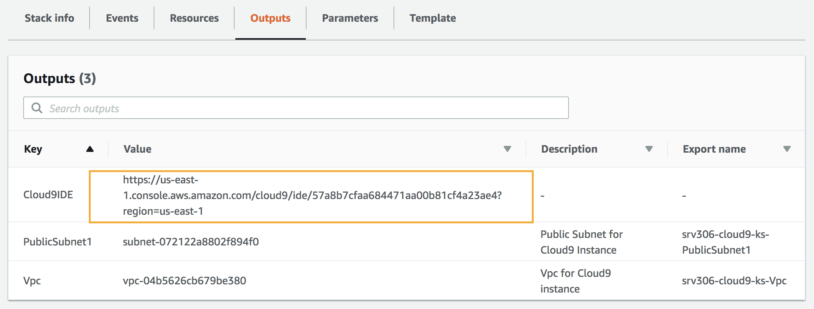
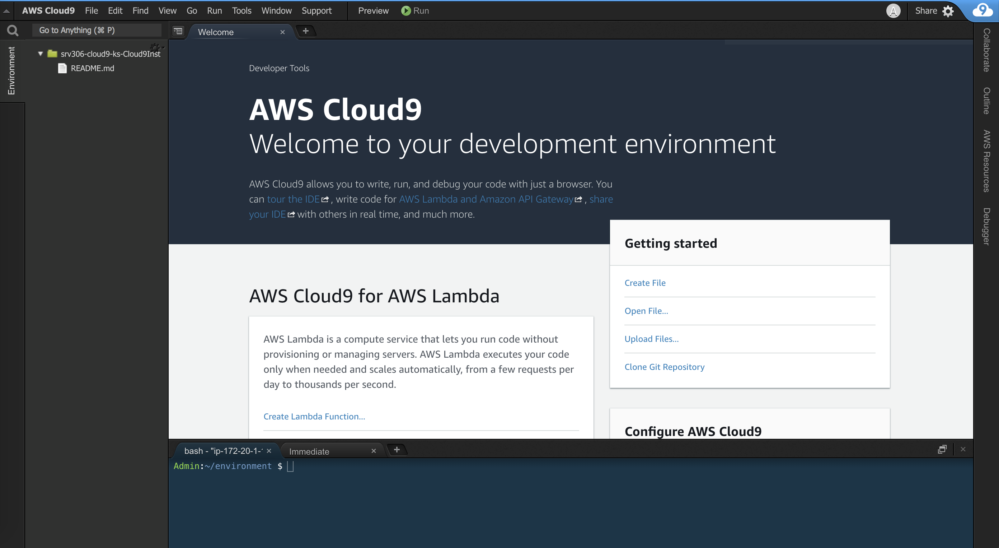

# Module 0 <small>Environment setup</small>

**Time**: 10 minutes

This section outlines the prerequisites to complete the workshop and instructions for launching a Cloud9 IDE environment that you will use throughout the workshop.

## Setup your Cloud9 IDE

To setup your environment please expand **one** of the following dropdown sections (depending on how you're doing this workshop) and follow the instructions: 

??? info  "Click here if you're at an *AWS event* where *Event Engine* is being used"
	
	1. Navigate to the <a href="https://dashboard.eventengine.run" target="_blank">Event Engine dashboard</a>
	2. Enter the **team hash** code that was distributed to you by the instructors.
	3. Click **AWS Console**.  The CloudFormation template for this round has already been prerun.

??? info  "Click here if you're running this individually in your own AWS Account"
    **Cloud9 IDE Setup**

    In this section you will launch a CloudFormation stack that will create a a new [Amazon VPC](https://aws.amazon.com/vpc/) environment and a [Cloud9 IDE](https://aws.amazon.com/cloud9/) Instance that you will use for the rest of the workshop.

    Region| Deploy
    ------|-----
    us-east-1 (N. Virginia) | <a href="https://console.aws.amazon.com/cloudformation/home?region=us-east-1#/stacks/new?stackName=serverless-idm-cloud9&templateURL=https://sa-security-specialist-workshops-us-east-1.s3.amazonaws.com/serverless-idm/env-setup.yaml" target="_blank"></a>
    us-east-2 (Ohio)| <a href="https://console.aws.amazon.com/cloudformation/home?region=us-east-2#/stacks/new?stackName=serverless-idm-cloud9&templateURL=https://sa-security-specialist-workshops-us-east-2.s3.us-east-2.amazonaws.com/serverless-idm/env-setup.yaml" target="_blank">
    us-west-2 (Oregon) | <a href="https://console.aws.amazon.com/cloudformation/home?region=us-west-2#/stacks/new?stackName=serverless-idm-cloud9&templateURL=https://sa-security-specialist-workshops-us-west-2.s3-us-west-2.amazonaws.com/serverless-idm/env-setup.yaml" target="_blank">

    1. Click the **Deploy to AWS** button above.  This will automatically take you to the console to run the template.

    2. The **Specify an Amazon S3 template URL** is already selected and the template URL is automatically added.  Click **Next**.

    3. On the **Specify Details** click **Next** (leave defaults). 
	
    4. On the **Options** click **Next** \(leave everything on this page as the default\).


    4. On the Review page, review the summary details then click **Create stack**.

    !!! warning "It will take a few minutes for the Stack to create."
        Choose the **Stack Info** tab to go to the overall stack status page and wait until the stack is fully launched and shows a status of *CREATE_COMPLETE*. Click the refresh icon periodically to see progress update.

## Browse to your Cloud9 IDE

<a href="https://aws.amazon.com/cloud9/" target="_blank">AWS Cloud9</a> is a cloud-based integrated development environment (IDE) that lets you write, run, and debug your code with just a browser. It includes a code editor, debugger, and terminal. Cloud9 comes pre-packaged with essential tools for popular programming languages and the AWS Command Line Interface (CLI) pre-installed so you don’t need to install files or configure your laptop for this workshop. 

1. With the **serverless-idm-cloud9** stack selected, click on the **Outputs** tab and copy the value shown for the *Cloud9IDE* to the clipboard. Browse to that URL in a new browser tab to load your IDE environment.

    !!! info "When you launch the stack, CloudFormation deploys a nested CloudFormation stack to launch the Cloud9 resources. You can safely ignore that template which is prefixed with "aws-cloud9-WildRydes-"."

    

Once you have launched and navigated to your Cloud9 workspace URL shown in your CloudFormation stack outputs, you should have an IDE environment as shown below:



You can run AWS CLI commands in here just like you would on your local computer. Verify that your user is logged in by running the following:

```
aws sts get-caller-identity
```

You should see output indicating your account and user information:

```
{
    "Account": "123456789012",
    "UserId": "AKIAI44QH8DHBEXAMPLE",
    "Arn": "arn:aws:iam::123456789012:user/Alice"
}
```
!!! info "Keep your AWS Cloud9 IDE opened in a tab throughout this workshop as you'll be using it for most all activities."

## Download Workshop Code

1. Switch to the tab where you have your Cloud9 IDE opened.

2. Clone the workshop repository to your IDE environment by running the following command in the Cloud9 terminal window:

```
git clone https://github.com/aws-samples/amazon-cognito-identity-management-workshop.git
```

## Initialize your developer workspace

Run the following commands to upgrade your Node.js version to the latest version of Node.js 8. The <a href="https://aws-amplify.github.io/" target="_blank">AWS Amplify</a> JavaScript library which we will be using requires Node.js 8 or higher.

```
nvm i 8
nvm alias default 8
```

Install the yarn package manager and website dependencies by running the following commands

```
npm install -g yarn
cd ~/environment/amazon-cognito-identity-management-workshop/website/
yarn install
```

!!! info  "Keep an open scratch pad open"
    Keep an open scratch pad in Cloud9 or a text editor on your local computer for notes.  When the step-by-step directions tell you to note something such as an ID or Amazon Resource Name (ARN), copy and paste that into the scratch pad tab.

---

After you have successfully setup your environment, you can proceed to the next module.