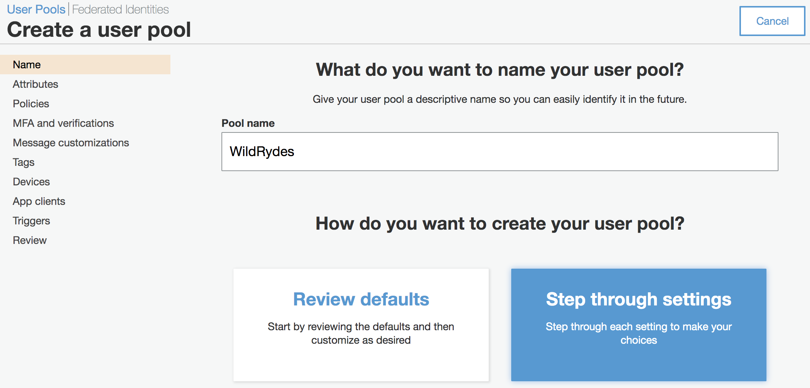
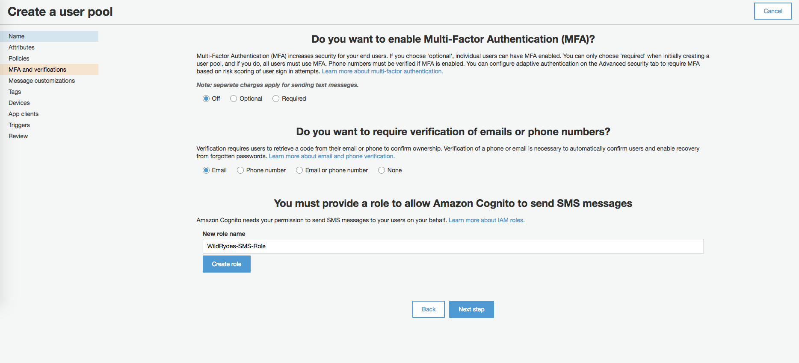
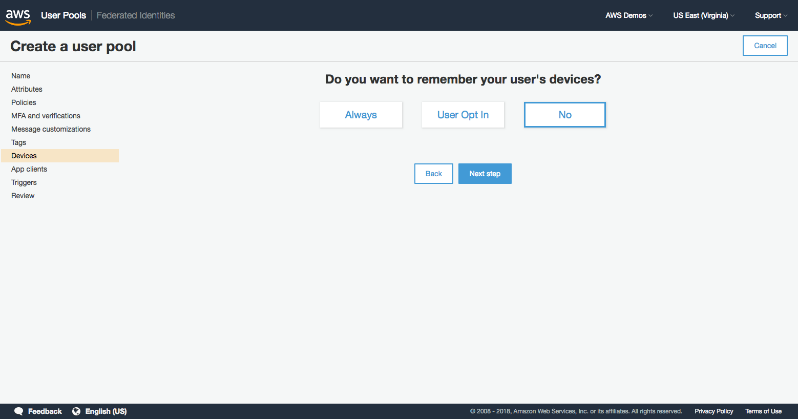
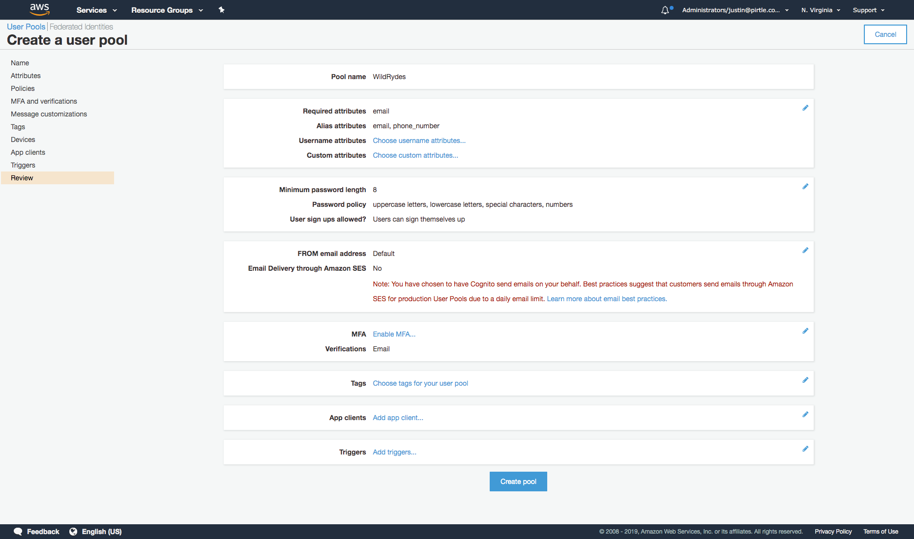

# Module 1 <small>User signup and authentication</small>

**Time**: 45 minutes

In this module, you will create an Amazon Cognito User Pool and Identity Pool for the Wild Rydes application.
The Cognito User Pool will store user profile information and provide sign-up and sign-in capabilities, with the Cognito Identity Pool providing the ability to assume an Identity and Access Management (IAM) role from within the application.

Since Wild Rydes is a ride sharing application, a key requirement is that all users must sign-up and sign-in before they're allowed to request a ride. You will configure the application to integrate with <a href="https://aws.amazon.com/cognito/" target="_blank">Amazon Cognito</a> for these purposes via the <a href="https://aws-amplify.github.io/" target="_blank">AWS Amplify</a> JavaScript library.

## Architecture

The architecture for this module is very straightforward. All of your static web content including HTML, CSS JavaScript, images and other files will be served locally from your Cloud9 workspace. As you make changes to the website application code, all changes will be automatically updated and shown in your browser via live reload capabilities.

For this module, we will be creating a Cognito User Pool as our secure user directory then configuring our application to use the AWS Amplify library to easily integrate Amazon Cognito into our application.


## Create a Cognito User Pool

Amazon Cognito User Pools lets you add user sign-up and sign-in capabilities to your web and mobile apps quickly and easily. In this step, we'll create a Cognito user pool for our Wild Rydes app.

Use the AWS console to create an Amazon Cognito User Pool requiring e-mail verification.

!!! warning     "The console's region will default to the last region you were using previously. Change this to the same region where you launched your Cloud9 environment previously."

1. Open the <a href="https://us-east-2.console.aws.amazon.com/cognito/home?" target="_blank">Amazon Cognito</a> console.

3. Choose **Manage User Pools**.

4. Choose **Create a User Pool** in the top right of the console.

5. Provide a name for your user pool such as **WildRydes**.

6. Choose **Step through settings** to configure our user pool options.

	

7. Leave **Username** selected, but additionally select **Also allow sign in with verified email address** and **Also allow sign in with verified phone number**.

    

8. Add a custom attribute for **genre** that is mutable.  This attribute is to give the Unicorn an idea of the riders favorite music genre

    

    !!! info "User Pool Attributes"
        Cognito User Pools have a standard set of attributes available for all users in the pool.  These are implemented following the <a href="https://openid.net/specs/openid-connect-core-1_0.html#StandardClaims" target="_blank">OpenID Connect specification</a>.  You can also optionally create up to 25 custom attributes to match any unique claims requirements you may have for your applications.

9. Choose **Next step**.

10. **Policies**: Leave password policies and user sign up settings set to default settings and choose **Next step**.

	<!--  -->

11. **MFA and verifications**: Leave the default settings for MFA and email verification and choose **Next step**.

    !!! info "MFA configurations are outside the scope of this workshop"

12. **Message customizations**:Leave the default for message and SES defaults and choose **Next step**.

	<!--  -->

15. **Tags**: Skip adding any tags and click **Next step**.

16. **Devices**: Choose **No** to not remember your user's devices then click **Next step**.

	

17. In the next screen, click the **Add an app client** *link*.

18. Input **wildrydes-web-app** as the app client name.

19. **Uncheck** *Generate client secret*. 

    !!! info "Client secrets are used for server-side applications authentication and are not needed for JavaScript applications.  They are also are not compatible with the Amplify JS SDK since it's a client library."

    

20. Choose **Create app client** and click **Next step**.

22. **Triggers**: Leave all Lambda trigger settings set to *none* and choose **Next step**. 

    !!! info "Lambda Triggers"
        These trigger settings allow you to extend the out-of-the-box sign-up and sign-in flows with your own custom logic.  You can add authentication challenges, migrate users, and customize verification messages.

24. Review summary of all provided settings for accuracy then choose **Create pool**.

	

26. Back in the AWS Cognito console, copy your new **User Pool Id** into the scratchpad.

	

27. Choose **App clients** heading under *General settings* within the Cognito navigation panel.

28. Copy the **App client ID** over to your scratchpad. You will be using both of these values later on.

	

## Create a Cognito Identity Pool

Cognito Identity Pools are used to provide AWS credentials via IAM roles to end-user applications. Since we'll be integrating our Cognito deployment and users with other AWS services, we'll go ahead and create this identity pool now.

You will need to create a Cognito Identity Pool linked to the Cognito User Pool and app client ID you just created. Your application will not require un-authenticated users to access any AWS resources, so you do not need to enable access to unauthenticated identities. 

1. In the Cognito console, choose **Federated Identities** in the header bar (top left) to switch to the console for Cognito Federated Identities.

1. Choose **Create new Identity pool**.

1. Input **wildrydes_identity_pool** as the Identity pool name.

1. Expand **Authentication providers**.

1. Within the Cognito tab, input the User Pool ID and App client Id you copied previously to the scratchpad tab.

	

1. Choose **Create Pool**.

1. Choose **Allow** to allow Cognito Identity Pools to setup IAM roles for your application's users. Permissions and settings of these roles can be customized later.

1. Copy/paste the **Identity Pool ID**, highlighted in red within the code sample in the Get AWS Credentials section, into your Cloud9 scatchpad editor tab.

	!!! warning "Do not copy the quotation marks, but include the region code and ":" character."

	
	
1. Your scratchpad should now have values for the following Cognito resources:

	

## Integrate your application with Amazon Cognito

Now that you've created and configured your Cognito User Pool and Identity Pool, you need to configure your application to integrate to Amazon Cognito so it can store user profiles and enable sign-up and sign-in.

You will import the <a href="https://aws-amplify.github.io/" target="_blank">AWS Amplify</a> JavaScript library into the project then add sign-up and sign-in utility classes to integrate with our existing UI and front-end components.

You'll need to complete the implementation of the onSubmitForm and onSubmitVerification methods within the **/website/src/auth/signIn.js** file, as well as the methods of the same name within the **/website/src/auth/signUp.js** file. Finally, you'll need to complete the implementation of a method to check whether the user is authenticated within the **/website/src/index.js** page.

1. Before using any AWS Amplify modules, we first need to configure Amplify to use our newly created Cognito resources by updating **/website/src/amplify-config.js**.  Open this file in your Cloud9 IDE editor.

1. Copy the following parameter values from your previous scratchpad into the config value parameter placeholders:
	- `identityPoolId`
	- `region`
	- `userPoolId`
	- `userPoolWebClientId (App Client ID)`

	!!! warning     "Be sure to fill in the **'' blanks** with your config values. You do not need to modify the example values shown in the comments as they are just for reference and not leveraged by your application."

1. **Save your changes** to the Amplify config file so your new  settings take effect. Any unsaved changes to a file are indicated by a dot icon in the tab of the editor so if you see a gray dot next to the file name, you may have forgotten to save.

1. Next, edit the **website/src/index.js** file to add the following lines to the **top of the file** **(but below all the other imports)** to configure Amplify then save your changes:

```javascript
import Amplify from 'aws-amplify';
import awsConfig from './amplify-config';

Amplify.configure(awsConfig);
```
	
After making this changes, your imports should be in the following order:
	

	
**Save your changes** to the *website/src/index.js* file.

Next, we need to ensure our application evaluates the user's authenticated state. 

1. In the same **/website/src/index.js** file, find and replace the **isAuthenticated method** with the code below to use our Amplify library's built-in user session to check this status.

```javascript
const isAuthenticated = () => Amplify.Auth.user !== null;
```

**Save your changes** to the */website/src/index.js* file.

Now that we've imported Amplify and configured the Amplify library, we need to update our application's code to sign-up users using Amplify and Cognito User Pools by finding and replacing the following methods within the **/website/src/auth/SignUp.js** file with the following code.

!!! tip     "Only replace the following two methods. The rest of the SignUp.js file should not be modified"
	The **onSubmitForm** method handles the event when the registration form is submitted. This calls the Auth.signUp method from the AWS Amplify library which registers the user with your Cognito User Pool.
	
	The **onSubmitVerification** method handles the event when the verification code entry form is submitted after the initial registration request. This calls the Auth.confirmSignUp method from the AWS Amplify library which confirms the user registration within your Cognito User Pool.

```javascript
async onSubmitForm(e) {
    e.preventDefault();
    try {
        const params = {
            username: this.state.email.replace(/[@.]/g, '|'),
            password: this.state.password,
            attributes: {
                email: this.state.email,
                phone_number: this.state.phone,
                'custom:genre': this.state.genre
            },
            validationData: []
        };
        const data = await Auth.signUp(params);
        console.log(data);
        this.setState({ stage: 1 });
    } catch (err) {
    if (err === "No userPool") {
        // User pool not defined in Amplify config file
        console.error("User Pool not defined");
        alert("User Pool not defined. Amplify config must be updated with user pool config");
    } else if (err.message === "User already exists") {
        // Setting state to allow user to proceed to enter verification code
        this.setState({ stage: 1 });
    } else {
        if (err.message.indexOf("phone number format") >= 0) {err.message = "Invalid phone number format. Must include country code. Example: +14252345678"}
        alert(err.message);
        console.error("Exception from Auth.signUp: ", err);
        this.setState({ stage: 0, email: '', password: '', confirm: '' });
    }
    }
}

async onSubmitVerification(e) {
    e.preventDefault();
    try {
        const data = await Auth.confirmSignUp(
            this.state.email.replace(/[@.]/g, '|'),
            this.state.code
        );
        console.log(data);
        // Go to the sign in page
        this.props.history.replace('/signin');
    } catch (err) {
        alert(err.message);
        console.error("Exception from Auth.confirmSignUp: ", err);
    }
}
```
**Save your changes** to the */website/src/auth/SignUp.js* file.

You additionally need to integrate the sign-in capability to use AWS Amplify and Cognito by finding and replacing the following methods within the **/website/src/auth/SignIn.js** file with the code below.

!!! tip     "You only need to the following two methods. The rest of the SignIn.js file should not be modified."
	The **onSubmitForm** method initiates the signin request with your Cognito User Pool by invoking the Auth.signIn method from AWS Amplify then sets the local state appropriately to indicate the user has signed in successfully.
	
	The **onSubmitVerification** method is used to submit a verification code whenever multi-factor authentication is required to authenticate. For this workshop, this method will not be invoked since you did not require multi-factor authentication earlier when configuring your Cognito User Pool.  

```javascript
async onSubmitForm(e) {
    e.preventDefault();
    try {
        const userObject = await Auth.signIn(
            this.state.email.replace(/[@.]/g, '|'),
            this.state.password
        );
        console.log('userObject', userObject);
        if (userObject.challengeName) {
            // Auth challenges are pending prior to token issuance
            this.setState({ userObject, stage: 1 });
        } else {
            // No remaining auth challenges need to be satisfied
            const session = await Auth.currentSession();
            // console.log('Cognito User Access Token:', session.getAccessToken().getJwtToken());
            console.log('Cognito User Identity Token:', session.getIdToken().getJwtToken());
            // console.log('Cognito User Refresh Token', session.getRefreshToken().getToken());
            this.setState({ stage: 0, email: '', password: '', code: '' });
            this.props.history.replace('/app');
        }
    } catch (err) {
        alert(err.message);
        console.error('Auth.signIn(): ', err);
    }
}

async onSubmitVerification(e) {
    e.preventDefault();
    try {
        const data = await Auth.confirmSignIn(
        this.state.userObject,
        this.state.code
        );
        console.log('Cognito User Data:', data);
        const session = await Auth.currentSession();
        // console.log('Cognito User Access Token:', session.getAccessToken().getJwtToken());
        console.log('Cognito User Identity Token:', session.getIdToken().getJwtToken());
        // console.log('Cognito User Refresh Token', session.getRefreshToken().getToken());
        this.setState({ stage: 0, email: '', password: '', code: '' });
        this.props.history.replace('/app');
    } catch (err) {
        alert(err.message);
        console.error('Auth.confirmSignIn(): ', err);
    }
}
```
**Save your changes** to the */website/src/auth/SignIn.js* file.

## Validate sign-up and sign-in

Now that you have integrated our Amplify code into our application, you need to test the site to see that authentication is working end-to-end.

Return to your browser tab where you started your Wild Rydes application earlier after popping out from the Cloud9 IDE once in preview mode. This page automatically refreshes after you save any code changes so should now reflect all of your changes and be ready for testing.

1. Click on the **Apply** link in the menu at the top right (or visit the `/register` path) of your Cloud9's website to go to the registration page.

1. Input the following: 
     * **e-mail address** (needs to be a valid email address since you'll need to verify your account), 
     * **phone number** with `+country_code` first preceeding the number (use a sample email address such as `+1234567890`)
     * **favorite genre** (e.g. `jazz`, `blues`, `classical`, etc.)
     * **password** twice (Your password must include 8 characters, including uppercase and lowercase characters, and at least 1 number and 1 special character.)

1. Choose **Let's Ryde** to submit registration.

1. On the verify e-mail screen, enter the one-time code sent to your e-mail address provided then choose **Verify**.

	!!! tip     "Be sure to check your spam folder for the e-mail with your verification code if you do not see it in your inbox."

1. Assuming no errors were encountered, you will be redirected to the Sign-in screen. Now, re-enter the same e-mail address and password you chose at registration.

1. If the page then loads a map, sign-in was successful and you have successfully integrated Cognito for app authentication.

1. Scroll down beyond the map to copy your user's identity token and decode it by pasting it into the 'encoded' input box at <a href="http://jwt.io" target="_blank">JWT.io</a>. You will see all of your user's attributes are encoded within the token, along with other standard attributes such as the time the token was issued, the time the token expires, the user's unique ID, and more.

## End of Module 1

Once you have finished setting up the user authentication please wait for the instructions from the presenter to move on to the next module (unless you're running this on your own).


---

If you've finished Module 1 early and would like to further customize the user sign up experience, feel free to run through the next section below.

Your current configuration supports a fairly generic user sign-up and sign-in flow.  If you have unique requirments for customized flows, you can leverage the built Lambda triggers.  These will trigger AWS Lambda functions during user pool operation such as user sign-up, confirmation, and sign-in.  You add authentication challenges, migrate users, and customize verification messages.

## Optional: Pre sign-up validation

Use the Lambda triggers to validate the email domain of the user to ensure it's a user from an approved domain prior to allowing them to sign-up.

1. Open the <a href="https://us-east-2.console.aws.amazon.com/lambda/home?" target="_blank">AWS Lambda</a> console.

2. Choose the **serverless-idm-wksp-pre-sign-up** function.

    !!! info     "The function was automatically created as part of the environment configuration CloudFormation template but is missing the application code."

3. Copy and paste the code below and save your function:

```python
from __future__ import print_function

def lambda_handler(event, context):

    # Log event
    print(event)

    # Set the user pool confirmation flags (you can user these to automatically confirm and a user and associated attributes)
    event['response']['autoConfirmUser'] = False
    event['response']['autoVerifyEmail'] = False
    event['response']['autoVerifyPhone'] = False

    # Set whitelisted domains
    domains = ["example.com"]

    # Split the email address so we can compare domains
    address = event['request']['userAttributes']['email'].split('@')

    # Validate the user is from a whitelisted domain'
    if address[1] in domains:
        print('Pre Sign Up validation succeeded for %s' % event['userName'])
    else:
        print('Pre Sign Up validation failed for %s' % event['userName'])
        raise Exception("Cannot sign up for the application with that email address.")

    # Return to Amazon Cognito
    return event
```
!!! info     "Be sure to replace the *example.com* domain after you've tested so that your user can pass the pre-signup validation."

Now that your Lambda function is configured, you can configure the trigger within your Cognito User Pool.

1. Open the <a href="https://us-east-2.console.aws.amazon.com/cognito/home?" target="_blank">Amazon Cognito</a> console.

2. Choose the **WildRydes** User Pool.

3. Click **Triggers** on the left navigation.

6. Under **Pre sign-up** choose **serverless-idm-wksp-pre-sign-up** and click **Save Changes**.

Now test out your pre validation logic by deleting the existing user in your User Pool (or create a new user) and ensure the function is triggering and properly validating the email address.  Feel free to play around with the logic to test out different validation scenarios. 

## Optional: Customize welcome message

Now leverage the **Custom Message** trigger to customize the welcome message.

1. Open the <a href="https://us-east-2.console.aws.amazon.com/lambda/home?" target="_blank">AWS Lambda</a> console.

2. Choose the **serverless-idm-wksp-custom-message** function.

    !!! info     "The function was automatically created as part of the environment configuration CloudFormation template but is missing the application code."

3. Copy and paste the code below and save your function:

```python
from __future__ import print_function

def lambda_handler(event, context):
    
    # Log event
    print(event)

    # This example uses a custom attribute 'custom:domain'
    if event['triggerSource'] == "CustomMessage_SignUp":
        event['response']['smsMessage'] = 'Bienvenido al servicio WildRydes. Su código de confirmación es %s' % event['request']['codeParameter']
        event['response']['emailSubject'] = 'Bienvenido a WildRydes!'
        event['response']['emailMessage'] = 'Bienvenido al servicio WildRydes. Su código de confirmación es %s' % event['request']['codeParameter']
    
    # Return to Amazon Cognito
    return event
```

!!! question     "Take note of the event TriggerSource.  When else will this Lambda function get triggered?"

Now that your Lambda function is configured, you can configure the trigger within your Cognito User Pool.

1. In the AWS Management Console choose **Services** then select **Cognito**.

2. Choose the **WildRydes** User Pool.

3. Click **Triggers** on the left navigation.

6. Under **Custom Message** choose **serverless-idm-wksp-custom-message** and click **Save Changes**.

Now follow the same steps as you previously did to test that the trigger is working as intended.

!!! info "Expect a small delay for the confirmation email."