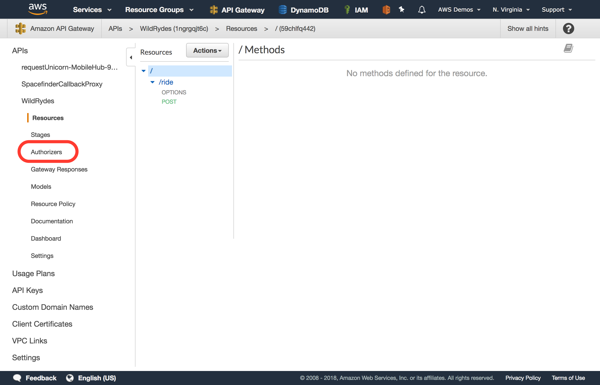
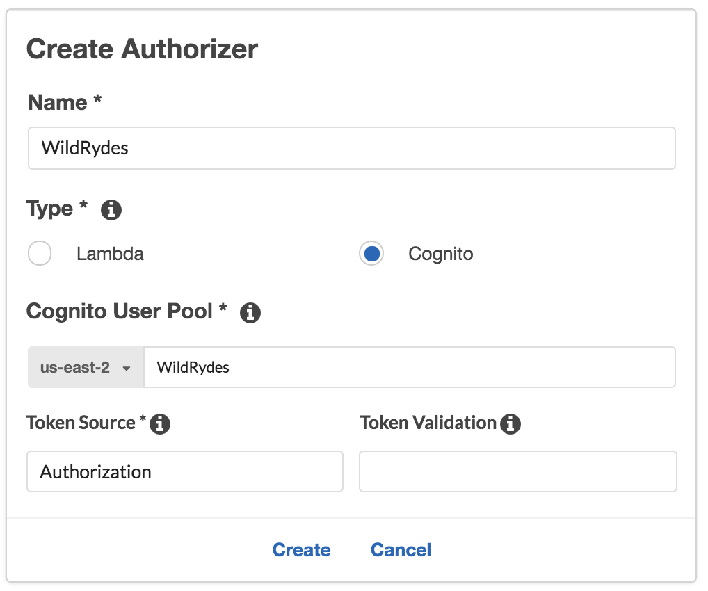
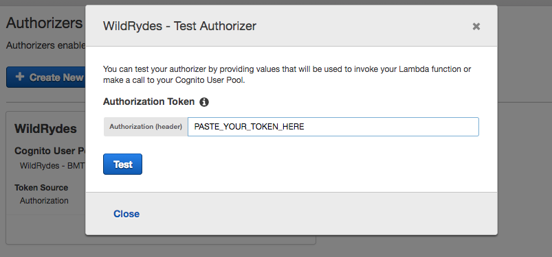
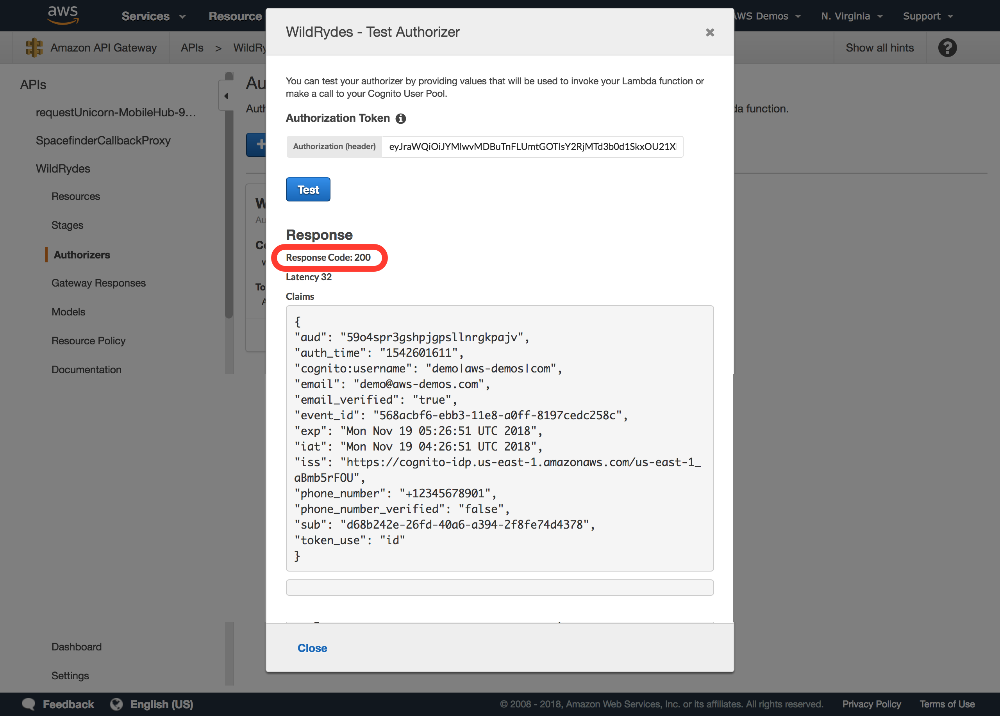
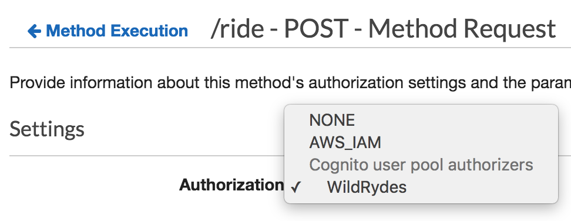
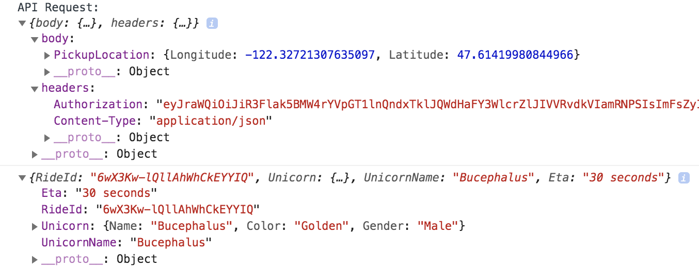
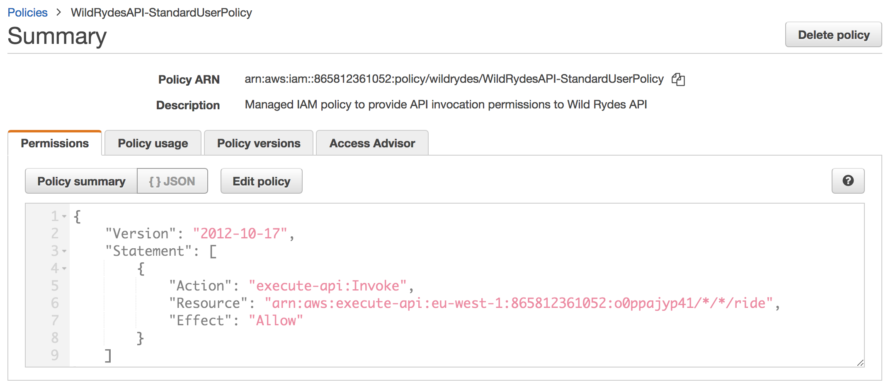
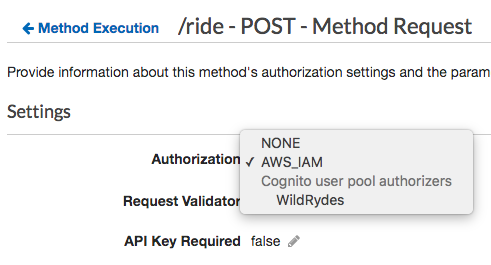
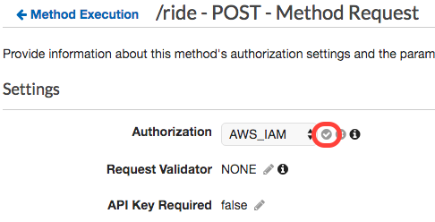

# Module 2 <small>Backend authorization with Amazon API Gateway</small>

**Time**: 30 minutes

In this module, you will add a serverless backend to your Wild Rydes application leveraging <a href="https://aws.amazon.com/api-gateway/" target="_blank">Amazon API Gateway</a> and <a href="https://aws.amazon.com/lambda/" target="_blank">AWS Lambda</a>. You will then enable authentication and authorization on your API to secure the backend to only accept valid, authorized requests.

## Architecture

Building on Module 1, this module will add a Serverless backend built using Amazon API Gateway and AWS Lambda. For persistence, you will use Amazon DynamoDB as a NoSQL data store. All of the above services are serverless so you can seamlessly scale your application as your demands grow. After creating the API, we will integrate our client application to call it via the AWS Amplify library.


## Launch the Serverless API backend

You will be creating your Serverless API built with Amazon API Gateway, AWS Lambda, and Amazon DynamoDB via a CloudFormation template. Since this workshop is focused on authentication and authorization, this template will create the backend infrastructure, but not enable any security settings and the rest of the module will enable and configure such settings.

Create a new WildRydes Serverless Backend stack by launching a CloudFormation stack based on the **serverless-backend.yaml** file in the templates folder.

This WildRydes backend CloudFormation template will provision your API Gateway deployment with Lambda functions for compute, a DynamoDB database for persistence, and an S3 bucket for photo uploads which will be used in module 3. Additionally, the necessary function invocation permissions and execution role for the Lambda function will also be provisioned.

Region| Deploy
------|-----
us-east-1 (N. Virginia) | <a href="https://console.aws.amazon.com/cloudformation/home?region=us-east-1#/stacks/new?stackName=serverless-idm-backend&templateURL=https://sa-security-specialist-workshops-us-east-1.s3.amazonaws.com/serverless-idm/serverless-backend.yaml" target="_blank"></a>
us-east-2 (Ohio)| <a href="https://console.aws.amazon.com/cloudformation/home?region=us-east-2#/stacks/new?stackName=serverless-idm-backend&templateURL=https://sa-security-specialist-workshops-us-east-2.s3.us-east-2.amazonaws.com/serverless-idm/serverless-backend.yaml" target="_blank">
us-west-2 (Oregon) | <a href="https://console.aws.amazon.com/cloudformation/home?region=us-west-2#/stacks/new?stackName=serverless-idm-backend&templateURL=https://sa-security-specialist-workshops-us-west-2.s3-us-west-2.amazonaws.com/serverless-idm/serverless-backend.yaml" target="_blank">

1. Click the **Deploy to AWS** button above.  This will automatically take you to the console to run the template.

2. The **Specify an Amazon S3 template URL** is already selected and the template URL is automatically added.  Click **Next**.

3. On the **Specify Details** click **Next**. 

4. On the **Options** click **Next** \(leave everything on this page as the default\).


4. On the Review page, choose to **Acknowledge that the CloudFormation template may create IAM resources with custom names**, review the summary details, and then click **Create stack**.

    !!! warning "It will take a few minutes for the Stack to create."
        Choose the **Stack Info** tab to go to the overall stack status page and wait until the stack is fully launched and shows a status of *CREATE_COMPLETE*. Click the refresh icon periodically to see progress update.

6. With the **serverless-idm-backend** stack selected, click on the **Outputs** tab and copy the value shown for the **WildRydesApiInvokeUrl** to your Cloud9 scratchpad editor tab.

## Integrate your API

Now that you have created our Serverless API, you need to update your Wild Rydes web application to integrate with it. You will leverage the AWS Amplify client library to make API calls and inject security seamlessly to support your authentication and authorization scenarios.

First, you need to update the **/website/src/amplify-config.js** file to include your new API Gateway endpoint. Store the endpoint including the /prod at the end in the endpoint property under the **WildRydesAPI** section.

!!! tip "Do not change the name `WildRydesAPI` in this configuration file."
	
```
API: {
    endpoints: [
        {
            name: 'WildRydesAPI',
            endpoint: 'https://1ngrgqjt6c.execute-api.us-east-1.amazonaws.com/prod',
            region: 'us-east-1'
        }
    ]
},
```

Next, you need to enable the hasAPI method by uncommenting its code within **/website/src/pages/MainApp.js**.

```javascript
hasApi() {
    const api = awsConfig.API.endpoints.filter(v => v.endpoint !== '');
    return (typeof api !== 'undefined');
}
```

Finally, within the same file, we will implement the API request for a ride as a POST request to our API which sends a body containing the requested latitude and longitude as the pickup location. Update the **getData()** method to be as follows:

```javascript
async getData(pin) {
    const apiRequest = {
        body: {
        PickupLocation: {
            Longitude: pin.longitude,
            Latitude: pin.latitude
        }
        },
        headers: {
        'Authorization': '', // To be updated
        'Content-Type': 'application/json'
        }
    };
    console.log('API Request:', apiRequest);
    return await API.post(apiName, apiPath, apiRequest);
}
```

## Validate API functionality and integration

Now that you've integrated code changes to call your new Serverless API, you should test the end-to-end user experience to ensure the application is working correctly. The API currently requires no authentication so any request will currently be accepted until we enable required authentication.

Go back to your browser tab with Wild Rydes running and sign-in again at `/signin`. Once signed in, click anywhere on the map to indicate a pickup location, then select the **Request** button to call your ride.

You should be informed of your unicorn's arrival momentarily.

## Enable API Gateway authorization with Cognito

Amazon API Gateway can use the JSON Web tokens (JWT) returned by Cognito User Pools to authenticate API calls. In this step, you'll configure an authorizer for your API to use the user pool you created in module 1.

Since Cognito User Pools implements <a href="https://openid.net/connect/" target="_blank">OpenID Connect</a> JSON web tokens, API Gateway is able to compare the signature of an access or identity token against the known public keys of the Cognito User Pool which allows verification and authentication to happen without having to write additional code in your application.

In the Amazon API Gateway console, create a new Cognito user pool authorizer for your API. Configure it to use the user pool that you created in the previous module. You can test the configuration in the console by copying and pasting the identity token printed to the console after you log in via the `/signin` path of your current website. Once setup, you will change your application's code to send the proper JSON web token with its API requests to authenticate.


1. In the AWS Management Console choose **Services** then select **API Gateway** under Networking and Content Delivery.

2. Choose the API named **WildRydes**.

3. Under your newly created API, choose **Authorizers**.

    

4. Chose **Create New Authorizer**.

5. Enter `WildRydes` for the Authorizer name.

6. Select **Cognito** for the type.

7. In the Region drop-down under **Cognito User Pool**, select the Region where you created your Cognito user pool in the last module (by default the current region should be selected).

8. Enter `WildRydes` (or the name you gave your user pool) in the **Cognito User Pool** input.

9. Enter `Authorization` for the **Token Source**.

10. Leave *Token Validation* **blank** without editing.

11. Choose **Create**.

    

**Verify your authorizer configuration**

12. In a different browser tab, return to your Wild Rydes application and  sign-in if you're not already signed in. After signing in, you should be redirected to */app*. Open your [browser's developer console](https://support.airtable.com/hc/en-us/articles/232313848-How-to-open-the-developer-console) and browse to the console log output section.

13. Look for the console log to say **Cognito User Identity Token:** and a long string beneath the message.

14. Copy the long string to your clipboard without the intro message. You will need to copy across multiple lines to fully copy the token in its entirety.

15. Go back to previous tab where you have just finished creating the Authorizer.

16. Click **Test** at the bottom of the card for the authorizer.

17. Paste the auth token into the **Authorization Token** field in the popup dialog.

    

18. Click **Test** button and verify that the response code is 200 and that you see the claims for your user displayed. Since this is the identity token, the user's attributes are encoded within the JWT as claims which can be read parsed programatically.

	!!! warning "If you do not receive successful test results as shown below, do not proceed until you're able to validate the authorizer is configured properly and passes this test."

	

**Require Cognito authentication for API Gateway**

19. Browse to **Resources** while within your Wild Rydes API in the API Gateway console.

20. Select the **POST** method under the */ride* resource path.

21. Choose **Method Request**

    

22. Choose the pencil icon next to `Authorization` to edit the setting.

23. Select your new Cognito Authorizer from the list of options presented.
	
    !!! tip "If you don't see this option listed, **Reload** the browser page then this authorizer option should appear in the drop-down list."

  

24. **Save** your selection by clicking the checkmark icon next to the drop down.

  

25. Next, choose the **Actions** button at the top of the resources list.

26. Choose **Deploy API** from the list of options presented.

27. For deployment stage, select `prod` then click **Deploy**.

28. You've now successfully deployed your new authentication integration to your API's production environment.

**Configure your Wild Rydes web app to authenticate API requests**

Now that you've deployed the new authorizer configuration to production, all API requests must be authenticated to be processed.

29. Return to your Wild Rydes app, sign in at */signin* if necessary, and attempt to request a ride.

30. You should receive an *Error finding unicorn*. If you open the developer console, you will see that we received a HTTP 401 error, which means it was an unauthorized request. To authenticate our requests properly, we need to send an Authorization header.

	!!! tip "If you at first still that you requests go through without any errors, try requesting a ride again in 30-60 seconds to allow the API Gateway changes to fully propagate."

31. Go back to Cloud9 and open the **/website/src/pages/MainApp.js** files.

32. Browse down to the **getData** method you previously updated. You will notice that the headers for the request currently include a blank *Authorization* header.

33. Replace your current *getData* method with the following code which sends your user's Cognito identity token, encoded as a JSON web token, in the *Authorization* header with every request.

```javascript
    async getData(pin) {
        const apiRequest = {
            body: {
            PickupLocation: {
                Longitude: pin.longitude,
                Latitude: pin.latitude
            }
            },
            headers: {
            'Authorization': this.state.idToken,
            'Content-Type': 'application/json'
            }
        };
        console.log('API Request:', apiRequest);
        return await API.post(apiName, apiPath, apiRequest);
    }
```

Allow the application to refresh, sign-in again, and request a ride.

The unicorn ride request should be fulfilled as before now. To see the full request headers which were sent, look at the developer console for an *API Request* informational message which includes the API Request details once expanded, including the full headers and body of the request.



If the API now invokes correctly and application functions as expected summoning unicorns, you may proceed to the next module.

## End of Module 2

Once you have finished setting up the backend authorization please wait for the instructions from the presenter to move on to the next module (unless you're running this on your own).  If you've finished Module 2 early and to try out some alternative authorzation methods, feel free to run through the next few sections.

---

In this optional extension, you will update your serverless backend for your Wild Rydes application leveraging Amazon API Gateway and AWS Lambda to use request signing with IAM-based authorization as a more secure authentication option.

## Optional: API Gateway Authorization with AWS IAM

This section updates your Serverless backend built earlier using Amazon API Gateway and AWS Lambda to use IAM-based authorization. This extends your authorization capability to offer fine-grained access control authorizing differently per API operation and enhancing security via request signing. By enabling IAM-based authorization, you will use the same type of authentication, authorization, and request signing used by all AWS services and SDKs.

<a href="https://docs.aws.amazon.com/general/latest/gr/signing_aws_api_requests.html" target="_blank">Request signing</a> is a more secure implementation of API request authentication where each API request made is signed with a signature unique to the request itself. Hence, no static API keys or bearer tokens are directly sent to the backend service and any man-in-the-middle attacks would not be able to use such API keys or bearer tokens to impersonate a valid user with the backend resources. AWS APIs and SDKs use a request signing algorithm named <a href="https://docs.aws.amazon.com/general/latest/gr/signature-version-4.html" target="_blank">Signature V4 (Sigv4)</a> which is what you will enable your API to use in this module.

!!! tip "For production APIs, you should use either the token-based authorization OR request signing authorization via IAM demonstrated in this module, but not use both for the same API."


**Attach an IAM policy to your Cognito authenticated users' role**

For you to be able to use request signing and IAM-based fine-grained access control, we'll first need to associate an IAM policy that provides permissions to invoke API operations for your API Gateway deployment. For further details, you can review <a href="https://docs.aws.amazon.com/apigateway/latest/developerguide/permissions.html" target="_blank">controlling access to an API with IAM permissions</a> documentation.

1. Go the AWS Management Console, click **Services** then select **IAM** under Security, Identity, and Compliance.

1. Choose **Policies**.

1. Search for **WildRydes** to see the **WildRydesAPI-StandardUserPolicy** which was created by the Serverless Backed CloudFormation template.

	
	
1. Click the **WildRydesAPI-StandardUserPolicy** policy name.

1. Review the policy which was created by CloudFormation to authorize requests to your API Gateway deployment.

	
	
    !!! info "This policy allows access to invoke any method on the /ride path for any API stage of your API gateway backend. For more details about authoring IAM policies for API Gateway, visit the <a href="https://docs.aws.amazon.com/apigateway/latest/developerguide/permissions.html" target="_blank">controlling access to an API with IAM permissions</a> documentation."

1. Choose **Roles**.

1. Search for *WildRydes* to find the two roles which were created by Cognito Identity Pools when you created the Identity Pool in module one. 
    
    !!! info "Should you not be able to find the roles here, you can alternatively go to the **Cognito Federated Identities** console, find the correct identity pool, then click **Edit Identity Pool** in the top-right corner to see the roles listed. Each identity pool has both an Unauthenticated user role and an Authenticated user role."

1. Select the **Auth* role** for your authenticated users.
	
	!!! info "If the full name of the role is hidden from view due to column width, you can hover over the partially visible name of the role to see the full name of the role as a tool tip."
	
	

1. Choose **Attach policies**.

1. Search for `WildRydes` and check the box next to the policy named *WildRydesAPI-StandardUserAccess*.

	

1. Choose **Attach policy**.

1. You should now see the *WildRydesAPI-StandardUserAccess* policy associated with your Cognito IAM auth role.

	

**Enable API Gateway authorization with AWS IAM**

In addition to using JSON Web Tokens (JWTs) for authentication, API Gateway can leverage AWS request signing and parse the request signature to determine the requesting user. In this step, you'll update your authorization type to *IAM* for your API which will then use AWS's Identity and Access Management (IAM) capabilities to authorize requests via IAM policies.

In the Amazon API Gateway console, update the authorization type to *AWS_IAM* for the *POST* method on the */ride* resource. Next, re-deploy the API to make your change take effect.

1. In the AWS Management Console choose **Services** then select **API Gateway** under Networking and Content Delivery.

2. Choose the API named **WildRydes**.

3. Browse to **Resources** while within your Wild Rydes API in the API Gateway console.

4. Select the **POST** method under the */ride* resource path.

5. Choose **Method Request**

    

6. Choose the pencil icon next to **Authorization** to edit the setting.

7. Select **AWS_IAM** from the list of authorization options presented.

  

8. **Save** your selection by clicking the checkmark icon next to the drop down.

  

9. Next, choose the **Actions** button at the top of the resources list.

10. Choose **Deploy API** from the list of options presented.

11. For deployment stage, select `prod` then click **Deploy**.

12. You've now successfully deployed your new authentication integration to your API's production environment.

**Configure your app to authenticate API requests**

Now that you've deployed the new authorizer configuration to production, all API requests must be authenticated to be processed.

13. Return to your Wild Rydes app, sign in at */signin* if necessary, and attempt to request a ride.

14. You should receive an *Error finding unicorn*. If you open the developer console, you will see that we received a HTTP 401 error, which means it was an unauthorized request.

	!!! tip "If at first your requests go through without any errors, try requesting a ride again in 30-60 seconds to allow time for the API Gateway changes to fully propagate."

15. Go back to Cloud9 and open the **/website/src/pages/MainApp.js** files.

16. Update your current *getData* method to the following method, which removes the *Authorization* header and adds debugging information to show us the request signature as requests are sent. The default behavior of the AWS Amplify library is the sign all requests with SigV4 signing when no authorization header is specified, so this will automatically sign all requests using this algorithm without extra development effort. **Save your changes** after making this update.

```javascript
    async getData(pin) {
        Amplify.Logger.LOG_LEVEL = 'DEBUG';
        const apiRequest = {
            body: {
            PickupLocation: {
                Longitude: pin.longitude,
                Latitude: pin.latitude
            }
            },
            headers: {
            'Content-Type': 'application/json'
            }
        };
        console.log('API Request:', apiRequest);
        return await API.post(apiName, apiPath, apiRequest);
    }
```

Allow the application to refresh, sign-in again, and request a ride.

The unicorn ride request should be fulfilled as before now. To see the full request headers which were sent, look at the developer console for an message which includes the API Request details, including the full signature and headers of the request.

!!! tip "This message starts with POST /prod/ride then shows the headers of the request made."
	    
    You may notice that there were both x-amz-date and x-amz-security-token headers sent among other headers. These two headers are part of the overall request signature, along with the Authorization header.