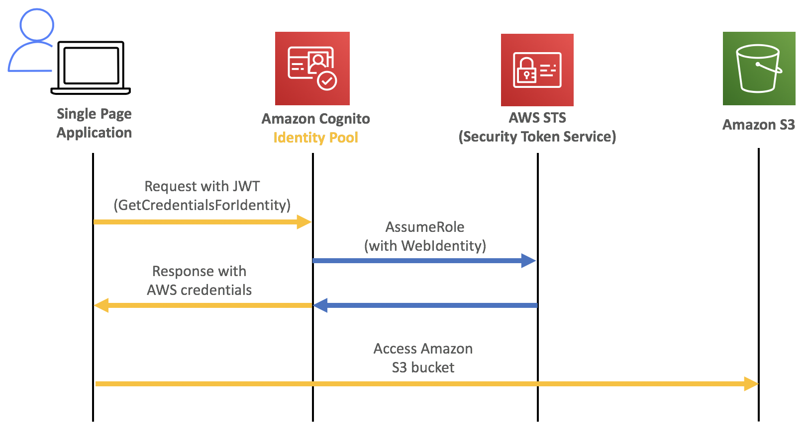
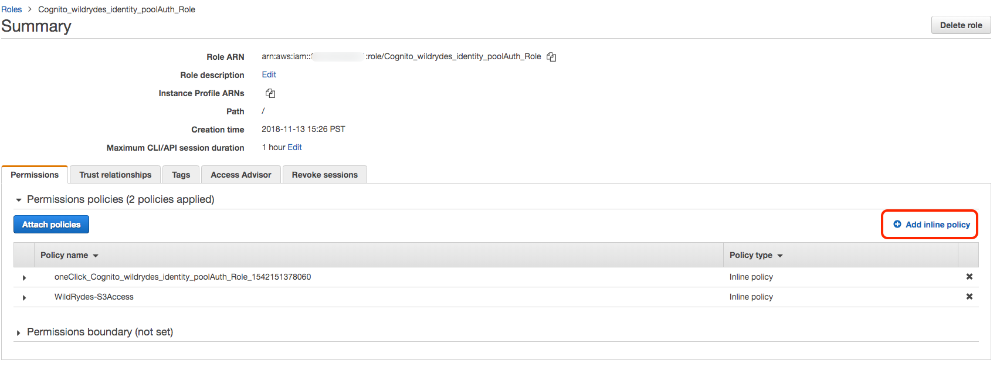

# Module 3 <small>Retrieving and using temporary AWS credentials</small>

**Time**: 15 minutes

In this module, you will expand your Wild Rydes application by enabling a profile management and profile photo management capabilities. Amazon Cognito will be used to store your user's profile information and custom attributes whereas <a href="https://aws.amazon.com/s3/" target="_blank">Amazon S3</a> will store your user's profile pictures, with a link to the photo only being stored in the user's profile directly.

## Architecture

Building on Modules 1 and 2, this module will add photo storage and management via an Amazon S3 bucket. For AWS resource access from a web application, Amazon Cognito will issue not only JWTs as we saw earlier, but then also allow users to assume an IAM role from within the application. This AWS IAM role will then allow their application to securely connect to upload and download photos from S3 (though any other AWS API would also work with this capability). To secure access to the photo storage and bucket, you will leverage IAM policies for fine-grained control.



## Setup S3 bucket for use with AWS Amplify

You will need to configure AWS Amplify to securely store profile images in an S3 bucket. To save time, the Serverless Backend CloudFormation template that created the serverless backend API for this workshop also created an S3 bucket for this purpose with the cross-origin resource sharing (CORS) settings already set. You just need to associate this bucket with your application's code.

To do this you'll browse to your CloudFormation stack created in the earlier modules and find the name of the S3 bucket under Outputs. Once you have the name you'll modify your **amplify-config.js** file again and update the storage section with the bucket's name and region.

1. Open the <a href="https://console.aws.amazon.com/cloudformation/home?" target="_blank">AWS CloudFormation</a> console.

1. In the CloudFormation console, click on your Wild Rydes stack name **serverless-idm-backend**.

1. Click on the **Outputs** tab.

1. Copy your bucket name to your clipboard. It is the name shown under Value for the key called **WildRydesProfilePicturesBucket**.

1. Next, return to your Cloud9 IDE and open the file **/website/src/amplify-config.js**.

1. Fill in values for both the bucket name, which you just copied, as well as the region where your CloudFormation template was launched

1. Your final structure for the storage configuration of **amplify-config.js** should look like the following.

```
    Storage: {
        bucket: 'wildrydes-profilepicturesbucket-1rmvuic97osxd',
        region: 'us-east-1'
    }
```

## Configure IAM permissions

Though you could now attempt uploading photos via AWS Amplify, Amplify would use your Cognito Identity Pool roles that were created in module 1 which currently has no policies associated so you would not have access to the S3 bucket created. You need to next update your roles to have policies that grant access to your S3 photo bucket.

Browse to the IAM console and find your Cognito Identity Pool's authenticated user role. Create an in-line policy on this role which provides for <a href="https://aws-amplify.github.io/docs/js/storage#file-access-levels" target="_blank">S3 bucket protected and private-level access</a> per-user by leveraging IAM policy variables. 


1. Open the <a href="https://console.aws.amazon.com/iam/home?" target="_blank">AWS IAM</a> console.

1. Choose **Roles**.

1. Search for **WildRydes** to find the two roles which were created by Cognito Identity Pools when you created the Identity Pool in module one. 

    !!! info "Should you not be able to find the roles here, you can alternatively go to the **Cognito Federated Identities** console, find the correct identity pool, then click **Edit Identity Pool** in the top-right corner to see the roles listed. Each identity pool has both an Unauthenticated user role and an Authenticated user role."

1. Select the **Auth* role** for your authenticated users.
	
	
	
1. Choose **Add inline policy** on the right-hand side to create a new inline policy associated to this IAM role.

	

1. Choose the **JSON** tab to allow you to free-form edit the new policy.

1. Paste the following IAM policy statements for S3 access. After pasting, you will need to go **replace the bucket name** listed in all caps with your bucket name (a total of 4 times).
	
	!!! tip "Be sure to leave the parts of the resource names before and after the replacement value alone and not accidentally modify them."
	    The following policy makes use of IAM policy variables where **${aws:userid}** represents the current authenticated user's unique Cognito identity ID. This policy's effective permissions will allow all authenticated users to read objects from the root of the bucket and any /protected path, but only allow users to read their own private sub-path and write to their sub-path within the protected path. These are default paths that are integrated with AWS Amplify to easily set <a href="https://aws-amplify.github.io/docs/js/storage#file-access-levels" target="_blank">file access levels</a>.

```json
{
    "Version": "2012-10-17",
    "Statement": [
        {
            "Effect": "Allow",
            "Action": [
                "s3:PutObject",
                "s3:GetObject",
                "s3:GetObjectVersion",
                "s3:DeleteObject",
                "s3:DeleteObjectVersion"
            ],
            "Resource": "arn:aws:s3:::REPLACE_WITH_YOUR_BUCKET_NAME/private/${aws:userid}/*"
        },
        {
            "Effect": "Allow",
            "Action": [
                "s3:GetObject",
                "s3:GetObjectVersion"
            ],
            "Resource": "arn:aws:s3:::REPLACE_WITH_YOUR_BUCKET_NAME/protected/*"
        },
        {
            "Effect": "Allow",
            "Action": [
                "s3:PutObject",
                "s3:DeleteObject",
                "s3:DeleteObjectVersion"
            ],
            "Resource": "arn:aws:s3:::REPLACE_WITH_YOUR_BUCKET_NAME/protected/${aws:userid}/*"
        },
        {
            "Effect": "Allow",
            "Action": [
                "s3:PutObject",
                "s3:GetObject",
                "s3:GetObjectVersion",
                "s3:DeleteObject",
                "s3:DeleteObjectVersion"
            ],
            "Resource": "arn:aws:s3:::REPLACE_WITH_YOUR_BUCKET_NAME/public/*"
        }
    ]
}
```
1. Choose **Review policy**.

1. Name the policy **WildRydes-S3Access**.

1. After reviewing for accuracy and any syntax errors, choose **Create policy**.


## Update application to upload photos

Now that your IAM policies and Amplify SDK are initialized, you will be able to upload photos and render S3 photos with minimal code using Amplify's built-in UI components. S3 image is the component used to both render image objects for a React application, as well as embeding an image picker to help with uploads.

Authenticate in the Wild Rydes app if you're not already logged in, then browse to the */profile* path. You will see that your Cognito User Pool attributes are being read dynamically by the system. Next, you will add an <a href="https://aws-amplify.github.io/docs/js/storage#s3image" target="_blank">image picker</a> from AWS Amplify to render a UI component for uploading and displaying photos stored in S3. These profile photos will be used to personalize the rider experience so unicorns know who to look for when picking up passengers.

1. After logging in to Wild Rydes (if you're not authenticated already), browse to the **/profile** path.

1. You should see that your e-mail address and phone number you registered with are displayed which are all of your currently populated attributes.

1. Open your Cloud9 IDE environment and open the file at **/website/src/pages/Profile.js**.

1. **Uncomment** the line that says **S3Image**.  It should end up looking like the following: 

    `{ <S3Image imgKey={this.state.image_key} onLoad={(url) => this.onImageLoad(url)} picker/> }`

    This instantiates an Amplify UI component for React apps for image rendering and uploading and only requires this single line of code.

1. Go back to the Wild Rydes app and visit the **/profile** path after logging in. You should now be able to upload photos with the new image picker.

## Store profile picture links in Cognito User Pools profile

With your image uploads now working, all will work as expected until you close your browser, but at that point the reference between your user profile and your profile picture will be lost. To fix this, you will leverage a Cognito User Pools user attribute called *picture* to persist the S3 object key so the same image can be loaded upon each login and persisted to be shown to the unicorns when you request a ride. You will need to update */website/src/pages/Profile.js* and a method called *onImageLoad* to make this possible.

Implement a method to persist the images uploaded to the current user's Cognito *picture* attribute each time the image is changed.

1. Open your Cloud9 IDE environment and open the file at **/website/src/pages/Profile.js**.

1. The S3Image UI component has a built-in method called **onImageLoad** which provides in its invocation the full URL of any image uploaded. We will make use of this built-in function to persist your image URLs out to Cognito.

1. Replace the existing **onImageLoad** function with the following code:

```
async onImageLoad(url) {
    if (!this.state.user.getSession) { return };
    console.log('Profile Picture URL:', url);
    try {
        let result = await Auth.updateUserAttributes(this.state.user, {
            'picture': this.state.image_key
        });
        console.log(result);
    } catch (ex) {
        console.error('Attribute update error:', ex);
    }
}
```

Now with this new method in place, upload a new photo after logging into Wild Rydes then close your browser. Open a new window and try logging in again. Your photo should load as it did previously.

## Conclusion

Congratulations! You've completed the Wild Rydes Auth workshop. We hope that this time and interactive learning has been valuable for you. This workshop was an adaptation of an existing workshop located in the aws-serverless-workshops <a href="https://github.com/aws-samples/aws-serverless-workshops" target="_blank">repo</a>.

Please proceed to the next module to run through the clean up steps to ensure you decommission all resources spun up during the workshop today.

Thank you for participating!